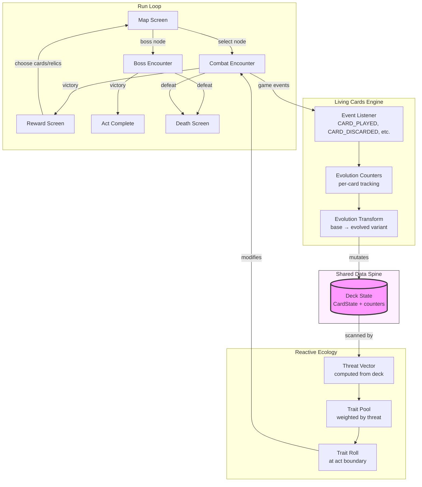

# STARFORGE: Roguelite Mode — Phase 0 Plan

> **Status**: Draft for review
> **Author**: Claude (planning agent)
> **Date**: 2026-05-02
> **Branch**: `claude/use-raw-github-urls-A3xj3` (see [Open Questions §1](#oq1-branch) re: branch naming)

---

## Executive Summary

This document plans a roguelite single-player mode for STARFORGE TCG, inspired by Slay the Spire 2. Two interlocking mechanics define the mode:

1. **Living Cards** — cards evolve based on usage during a run (play count, hold duration, discard count, combos, survival). Each card has 2–3 branching evolution paths. Progress is visible as counters on each card.
2. **Reactive Ecology** — enemies in later acts adapt to the player's evolved deck via a hidden threat vector. The deck state is the shared data object both systems read.

**MVP scope**: 1 playable character (Cogsmith), 1 antagonist faction (Hivemind), 1 act with 3 sub-regions, ~40 base cards (~100 evolved states), 15 enemy templates, 15 relics, 30–45 minute run length.

**Key finding from codebase inventory**: The existing `GameEngine`, card system, and `EventEmitter` are mode-agnostic and extensible. The roguelite mode can reuse the engine (with configuration), card rendering, and event bus without forking. However, the existing Dungeon mode has its own standalone combat engine — the new roguelite should NOT follow that pattern but instead extend the main engine.

**Critical corrections to the brief**:
- Rendering is pure **React + CSS**, not Pixi.js (Pixi is not in the repo)
- State management is **React Context + useState**, not Zustand
- Persistence is **localStorage** throughout, not IndexedDB
- "Warp Riders" is not a faction in code — likely refers to `PHANTOM_CORSAIRS`

---

## 1. Codebase Inventory

### 1.1 Existing Modes

| Mode | Entry | State | Status |
|------|-------|-------|--------|
| **1v1 PvE** | `App.tsx:59` → `GameBoard` + `GameProvider` | `GameContext.tsx` (React Context) | Fully implemented |
| **1v1 PvP** | `App.tsx` → `GameBoard` + `PvPGameProvider` | `PvPGameContext.tsx` + `MultiplayerManager.ts` (PeerJS) | Fully implemented |
| **Campaign** | `CampaignMap.tsx` / `CampaignGame.tsx` | `CampaignState.ts` (localStorage `'starforge_campaign'`) | Implemented — 8 story encounters/faction |
| **Dungeon** | `DungeonRun.tsx` | `DungeonState.ts` (localStorage `'starforge_dungeon'`) | Implemented — 24 bosses, 15 relics, **own combat engine** |
| **Puzzle** | `PuzzleMode.tsx` | `PuzzleState.ts` (localStorage) | Partially implemented — 26 puzzles |
| **Tag Team** | — | `TagTeamState.ts` | Stub only |

**Mode selection**: `MainMenu.tsx:42-50` dispatches callbacks (`onStartGame`, `onCampaign`, `onDungeonRun`, etc.). Adding a new mode requires one callback + one route case in `App.tsx`.

**State pattern**: Every mode uses React Context wrapping a `GameEngine` instance (except Dungeon, which has its own pure-function combat at `src/dungeon/engine/combat.ts`).

### 1.2 Card System

**CardDefinition** (`src/types/Card.ts:65-115`) — static template:
- `id`, `name`, `cost`, `type` (MINION/SPELL/STRUCTURE), `race?`, `rarity`
- `attack?`, `health?`, `tribe?` (MECH, BEAST, ELEMENTAL, etc.)
- `keywords: KeywordInstance[]`, `effects: Effect[]`
- `starforge?: StarforgeDefinition` — existing upgrade mechanic
- `flavorText?`, `collectible?`, `set?`

**CardInstance** (`src/types/Card.ts:120-188`) — runtime state:
- `instanceId`, `definitionId`, `ownerId`, `controllerId`
- `currentCost`, `currentAttack`, `currentHealth`
- `keywords`, `hasAttackedThisTurn`, `summonedThisTurn`
- `hasBarrier`, `isCloaked`, `isSilenced`
- `starforgeProgress`, `isForged`
- `temporaryBuffs`, `permanentBuffs`, `enchantments`
- `zone` (HAND, DECK, FIELD, GRAVEYARD, etc.)

**Effects** (`src/types/Effects.ts`) — fully declarative:
- `EffectType` enum: DAMAGE, HEAL, BUFF, DRAW, DISCARD, SUMMON, DESTROY, SILENCE, etc. (17 types)
- `EffectTrigger` enum: ON_PLAY, ON_DEATH, ON_ATTACK, ON_TURN_START, AURA, PASSIVE, etc. (17 triggers)
- `TargetType` enum: SELF, CHOSEN, RANDOM_ENEMY, ALL_ENEMY_MINIONS, etc.
- Resolution pipeline: `EffectResolver.ts` maps declarative effects → state mutations with recursion guard (depth 10)

**Singletons**: `globalCardDatabase` and `globalCardFactory` at module scope. Database stores `Map<cardId, CardDefinition>` with indexes by race/cost/rarity/type. Populated via `initializeSampleDatabase()` or `initializeFullDatabase()`.

**Card rendering** (`src/ui/components/Card.tsx`): Consumes `CardInstance` props. Uses emoji art + CSS — not coupled to specific game mode. Shows stat coloring (buff=green, debuff=red), keywords, tribe badges. Pluggable for roguelite cards without changes to the component itself.

### 1.3 Combat & Engine

**GameEngine** (`src/engine/GameEngine.ts:65+`):
- Constructor: `GameEngine(config, cardDatabase, cardFactory)` — accepts injected dependencies
- Core: `initializeGame()`, `getState()`, `executeAction(action)`, `validateAction(action)`
- Turn phases: SETUP → MULLIGAN → TURN_START → MAIN → COMBAT → TURN_END → GAME_OVER
- State: `Map<string, PlayerState>`, `Map<string, CardInstance>` — generic, supports any player count

**CombatResolver** (`src/combat/CombatResolver.ts`):
- `validateAttack()`, `resolveAttack()` — Hearthstone-style minion combat
- Full keyword interaction: GUARDIAN (taunt), BARRIER, SWIFT/BLITZ, CLOAK, DRAIN, BANE, DOUBLE_STRIKE
- Returns `CombatResult` with damage/death/trigger data

**EventEmitter** (`src/events/EventEmitter.ts` + `GameEvent.ts`):
- Pub/sub bus: `CARD_PLAYED`, `CARD_DISCARDED`, `CARD_DRAWN`, `CARD_DESTROYED`, `ATTACK_RESOLVED`, `DAMAGE_DEALT`, `STARFORGE_TRANSFORMED`, `CARD_ZONE_CHANGED`, etc. (~40 event types)
- Already provides all hooks needed for evolution triggers — no new instrumentation required

### 1.4 Persistence

- All single-player state uses `localStorage` with string keys (`'starforge_dungeon'`, `'starforge_campaign'`, etc.)
- No IndexedDB usage anywhere in the codebase
- Backend (`server/`) is Express + PostgreSQL + JWT — used for multiplayer auth/lobby only, not single-player saves

### 1.5 Rendering

- **No Pixi.js** in `package.json` or codebase
- All rendering is React components + CSS:
  - `Card.tsx` — emoji art, inline styles
  - `GameBoard.tsx` — flexbox layout
  - `AttackAnimation.tsx` — CSS keyframe animations
  - `VFXOverlay.tsx` — floating damage/heal numbers (React Portal + CSS)
  - `BoardVFX.tsx` — CSS particle effects
- This is sufficient for MVP; Pixi.js can be introduced later for polish if needed

### 1.6 Races

`src/types/Race.ts:10-33` defines 10 races + Neutral. Launch factions (playable in-game): `PYROCLAST`, `COGSMITHS`, `LUMINAR`, `PHANTOM_CORSAIRS`. No "Warp Riders" exists in code.

### 1.7 Integration Blockers

**No hard blockers.** Soft concerns:

| Concern | Severity | Mitigation |
|---------|----------|------------|
| `globalCardDatabase` singleton | Medium | Instantiate separate `CardDatabase` for roguelite pool; pass to engine constructor |
| Dungeon mode has parallel combat engine | Low | New mode uses main `GameEngine`, not dungeon's. Modes coexist. |
| Crystal resource system is TCG-shaped | Medium | Roguelite uses "energy" — configure via `GameEngine` config or extend resource model |
| No discard-pile cycling in TCG | Medium | Add draw-from-discard logic to engine (small extension) |

---

## 2. Architecture Proposal

### 2.1 Module Layout

```
src/roguelite/
├── types/
│   ├── RogueliteCard.ts        # EvolutionRule, CardState, RogueliteCardDef
│   ├── RogueliteEnemy.ts       # EnemyTemplate, TraitSlot, EnemyInstance
│   ├── RogueliteRun.ts         # Run, MapNode, Act, SubRegion
│   ├── RogueliteRelic.ts       # Relic, RelicEffect
│   └── ThreatVector.ts         # ThreatVector, DamageProfile, EffectDensity
├── engine/
│   ├── RogueliteEngine.ts      # Wraps GameEngine with roguelite rules (energy, cycling)
│   ├── EvolutionEngine.ts      # Listens to events, tracks counters, triggers evolutions
│   ├── EcologyEngine.ts        # Computes ThreatVector, rolls enemy traits
│   └── RelicEngine.ts          # Applies relic effects as passive modifiers
├── state/
│   ├── RunStateManager.ts      # Run lifecycle (start, save, resume, end)
│   └── PersistenceAdapter.ts   # localStorage wrapper (IndexedDB upgrade path)
├── content/
│   ├── CogsmithCards.ts        # 40 base cards + evolution specs
│   ├── HivemindEnemies.ts      # 15 enemy templates + trait pools
│   ├── Relics.ts               # 15 relic definitions
│   └── MapTemplates.ts         # Map node/path generation data
├── ai/
│   └── RogueliteAI.ts          # Enemy turn AI (extends or adapts existing AIPlayer)
└── ui/
    ├── RogueliteGame.tsx        # Top-level game screen
    ├── RogueliteMap.tsx         # Map/node selection screen
    ├── EvolutionOverlay.tsx     # Card evolution counter display + branch preview
    ├── RewardScreen.tsx         # Post-combat card/relic rewards
    ├── DeathScreen.tsx          # Run-over summary + unlock progress
    └── RogueliteContext.tsx     # React Context for roguelite state
```

### 2.2 System Diagram



### 2.3 Integration Points

**Extend, don't fork:**

| System | Strategy |
|--------|----------|
| `GameEngine` | Wrap in `RogueliteEngine` — configures energy (not crystals), deck cycling, relic hooks |
| `CardDatabase` | New instance for roguelite pool — passed to engine constructor, NOT the global singleton |
| `CardFactory` | Reuse `globalCardFactory` — it's stateless (just creates instances from definitions) |
| `Card.tsx` | Reuse as-is — roguelite `CardInstance` has same shape. Evolution counters rendered via `EvolutionOverlay` wrapper |
| `EffectResolver` | Reuse — declarative effects work identically |
| `CombatResolver` | Reuse — keyword combat is mode-agnostic |
| `EventEmitter` | Reuse — `EvolutionEngine` subscribes to existing events |
| `AIPlayer` | Fork to `RogueliteAI` — enemy behavior differs significantly (scripted patterns, trait-driven abilities) |

**Route integration**: Add `'roguelite'` to `GameScreen` union in `App.tsx`. Add `onRoguelite` callback to `MainMenu.tsx`. Wrap in `RogueliteContext`.

### 2.4 Persistence Model

```typescript
// localStorage key: 'starforge_roguelite_run'
// Follows existing convention (dungeon uses 'starforge_dungeon')
// IndexedDB is a future upgrade — see PersistenceAdapter

interface PersistedRun {
  version: number;              // Schema version for migration
  seed: string;                 // Deterministic seed for map/rewards
  character: 'cogsmith';        // Future: union of character IDs
  act: number;
  currentNodeId: string;
  completedNodeIds: string[];
  deck: PersistedCardState[];   // Card IDs + evolution counters
  relics: string[];             // Relic IDs
  currentHP: number;
  maxHP: number;
  gold: number;
  mapData: PersistedMapNode[];  // Serialized map graph
  threatVector: ThreatVector;   // Current ecology state
  stats: RunStats;              // For death screen / meta
  timestamp: number;
}
```

The `PersistenceAdapter` wraps `localStorage.getItem`/`setItem` with JSON serialization and version checking. Its interface (`save(run)`, `load(): Run | null`, `clear()`) is designed so swapping to IndexedDB later requires changing only the adapter internals.

### 2.5 Server Hooks (Future, Not MVP)

Identified hooks for post-MVP backend integration:
- **Leaderboard**: POST run result (score, seed, character, relics, evolved cards) on death/victory
- **Daily seed**: GET today's seed from server → deterministic daily challenge
- **Meta progression sync**: POST/GET unlock state for cross-device play
- **Analytics**: POST run telemetry (cards picked, evolutions chosen, death cause)

These are NOT implemented in MVP. The architecture leaves room via `PersistenceAdapter` and a future `RogueliteAPI` service.

---

## 3. Data Model

All types below are planning artifacts — they will become real TypeScript files in Phase 1.

### 3.1 Core: EvolutionRule

```typescript
/**
 * Trigger conditions that advance evolution counters.
 */
enum EvolutionTriggerType {
  PLAY_COUNT = 'PLAY_COUNT',           // Card played N times
  HOLD_DURATION = 'HOLD_DURATION',     // Held in hand for N turns without playing
  DISCARD_COUNT = 'DISCARD_COUNT',     // Discarded N times
  COMBO_AFTER = 'COMBO_AFTER',         // Played immediately after card X
  SURVIVE_DAMAGE = 'SURVIVE_DAMAGE',   // Survived N points of damage while on board
  SURVIVE_ATTACK_TYPE = 'SURVIVE_ATTACK_TYPE', // Survived specific keyword attack
  KILL_COUNT = 'KILL_COUNT',           // Destroyed N enemy minions
  EFFECT_HITS = 'EFFECT_HITS',         // Effect hit N targets
}

/**
 * A single evolution trigger condition.
 */
interface EvolutionTrigger {
  type: EvolutionTriggerType;
  threshold: number;
  /** For COMBO_AFTER: the card definition ID to combo with */
  comboCardId?: string;
  /** For SURVIVE_ATTACK_TYPE: the keyword that must be on the attacker */
  attackKeyword?: Keyword;
}

/**
 * One evolution path on a card. A card has 2-3 of these.
 * Each path has its own trigger and result.
 */
interface EvolutionPath {
  /** Unique ID for this path (e.g., 'gear-golem-overclocked') */
  id: string;
  /** Human-readable name shown in UI (e.g., 'Overclocked') */
  name: string;
  /** Description of what changes */
  description: string;
  /** Trigger that must be satisfied */
  trigger: EvolutionTrigger;
  /** The card definition ID this card becomes when evolved */
  evolvedCardId: string;
  /** Whether evolution can be reversed (MVP: always false) */
  reversible: boolean;
  /** Visual indicator tier (subtle → dramatic) */
  visualTier: 1 | 2 | 3;
}

/**
 * Full evolution spec attached to a roguelite card definition.
 */
interface EvolutionSpec {
  /** Available evolution paths (2-3 per card) */
  paths: EvolutionPath[];
  /** Whether only one path can be chosen (true) or multiple (false) */
  exclusive: boolean;
}
```

### 3.2 Core: ThreatVector

```typescript
/**
 * Damage type categories for threat profiling.
 */
enum DamageCategory {
  DIRECT = 'DIRECT',         // Single-target damage
  AOE = 'AOE',               // Multi-target damage
  POISON = 'POISON',         // Damage-over-time / debuff
  DRAIN = 'DRAIN',           // Lifesteal-style
  BURN = 'BURN',             // Pyroclast-style fire
  VOID = 'VOID',             // Banish / removal
}

/**
 * Effect density categories.
 */
enum EffectCategory {
  REMOVAL = 'REMOVAL',       // Hard removal (destroy, banish)
  BUFF = 'BUFF',             // Stat increases
  DRAW = 'DRAW',             // Card draw / cycling
  SUMMON = 'SUMMON',         // Token/minion generation
  HEAL = 'HEAL',             // HP restoration
  CONTROL = 'CONTROL',       // Silence, return, freeze
}

/**
 * Rolling summary of the player's deck, computed after each combat.
 * Read by the Ecology engine to adapt enemy composition.
 */
interface ThreatVector {
  /** Distribution of damage types across deck (sums to 1.0) */
  damageProfile: Record<DamageCategory, number>;
  /** Density of effect categories (0.0–1.0 each, independent) */
  effectDensity: Record<EffectCategory, number>;
  /** How evolved the deck is (0.0 = all base, 1.0 = all fully evolved) */
  evolutionMomentum: number;
  /** Average card cost — signals aggro vs control */
  avgCost: number;
  /** Keyword frequency distribution */
  keywordProfile: Partial<Record<Keyword, number>>;
  /** Risk score: composite metric for difficulty scaling (0.0–1.0) */
  riskScore: number;
}
```

### 3.3 Card Types

```typescript
/**
 * Roguelite card definition — extends base CardDefinition concept
 * but lives in a separate database (not mixed with TCG cards).
 */
interface RogueliteCardDefinition {
  /** Unique ID (prefixed 'rl-' to avoid collision with TCG IDs) */
  id: string;
  name: string;
  cost: number;
  type: CardType;
  rarity: CardRarity;
  attack?: number;
  health?: number;
  tribe?: MinionTribe;
  keywords: KeywordInstance[];
  effects: Effect[];
  flavorText?: string;
  /** Art asset path (populated in art phase) */
  artUrl?: string;
  /** Evolution spec — null for cards that don't evolve (tokens, summons) */
  evolution: EvolutionSpec | null;
  /** Tags for threat vector computation */
  damageCategories: DamageCategory[];
  effectCategories: EffectCategory[];
  /** Which character can use this card (null = any) */
  characterRestriction: string | null;
}

/**
 * Runtime state of a card during a run.
 * Wraps a CardInstance with evolution tracking.
 */
interface RogueliteCardState {
  /** The underlying card instance (reuses existing CardInstance) */
  instance: CardInstance;
  /** Base definition ID (before any evolution) */
  baseDefinitionId: string;
  /** Current definition ID (changes on evolution) */
  currentDefinitionId: string;
  /** Per-path evolution counters */
  evolutionCounters: Record<string, number>;
  /** Which path was evolved into, if any */
  evolvedPathId: string | null;
  /** Run-scoped stats */
  totalPlays: number;
  totalDiscards: number;
  turnsHeld: number;
  totalKills: number;
  totalDamageDealt: number;
  totalDamageSurvived: number;
}
```

### 3.4 Enemy Types

```typescript
/**
 * An adaptive trait that can be slotted onto an enemy.
 * Traits are the mechanism for reactive ecology.
 */
interface TraitDefinition {
  id: string;
  name: string;
  description: string;
  /** Passive stat modifiers */
  statModifiers?: {
    attackBonus?: number;
    healthBonus?: number;
    costReduction?: number;
  };
  /** Keywords granted to the enemy */
  grantedKeywords?: Keyword[];
  /** Additional effects triggered by the enemy */
  grantedEffects?: Effect[];
  /** What threat categories this trait counters */
  counters: DamageCategory[] | EffectCategory[];
}

/**
 * Trait slot on an enemy template.
 * Filled at act boundaries by the ecology engine.
 */
interface TraitSlot {
  /** Slot priority — higher = filled first */
  priority: number;
  /** Pool of possible traits for this slot, with base weights */
  traitPool: Array<{
    traitId: string;
    baseWeight: number;
  }>;
  /** Filled trait (null until ecology rolls it) */
  filledTraitId: string | null;
}

/**
 * Enemy template — static definition of an enemy type.
 */
interface EnemyTemplate {
  id: string;
  name: string;
  description: string;
  tier: 'common' | 'elite' | 'boss';
  /** Base stats before trait modifications */
  baseAttack: number;
  baseHealth: number;
  /** Innate keywords (always present) */
  innateKeywords: Keyword[];
  /** Innate effects (always present) */
  innateEffects: Effect[];
  /** Adaptive trait slots (filled by ecology) */
  traitSlots: TraitSlot[];
  /** Enemy intent patterns (telegraph system) */
  intentPatterns: IntentPattern[];
  /** Faction this enemy belongs to */
  faction: 'hivemind';
  /** Art asset path */
  artUrl?: string;
}

/**
 * Enemy intent — telegraphed next action.
 */
interface IntentPattern {
  id: string;
  type: 'attack' | 'defend' | 'buff' | 'summon' | 'special';
  /** Damage value (for attack intents) */
  value?: number;
  /** How many turns this intent repeats before cycling */
  duration: number;
  /** Priority weight for AI selection */
  weight: number;
}

/**
 * Runtime enemy instance during combat.
 */
interface EnemyInstance {
  templateId: string;
  instanceId: string;
  currentAttack: number;
  currentHealth: number;
  maxHealth: number;
  activeKeywords: Keyword[];
  activeEffects: Effect[];
  filledTraits: TraitDefinition[];
  currentIntent: IntentPattern;
  statusEffects: StatusEffect[];
}

interface StatusEffect {
  id: string;
  name: string;
  stacks: number;
  duration: number | 'permanent';
}
```

### 3.5 Run & Map Types

```typescript
/**
 * A single node on the run map.
 */
interface MapNode {
  id: string;
  type: 'combat' | 'elite' | 'boss' | 'rest' | 'event' | 'shop' | 'treasure';
  position: { row: number; col: number };
  /** IDs of nodes this connects to (forward edges only) */
  connections: string[];
  /** Whether this node has been visited */
  visited: boolean;
  /** Enemy template IDs for combat nodes */
  enemies?: string[];
  /** Event/shop/treasure data (resolved at visit time) */
  content?: NodeContent;
}

type NodeContent =
  | { type: 'event'; eventId: string }
  | { type: 'shop'; inventory: ShopItem[] }
  | { type: 'treasure'; relicId: string }
  | { type: 'rest'; healAmount: number };

interface ShopItem {
  type: 'card' | 'relic' | 'remove_card';
  itemId?: string;
  cost: number;
}

/**
 * Sub-region within an act.
 */
interface SubRegion {
  id: string;
  name: string;
  theme: string;
  nodes: MapNode[];
  /** Number of rows (depth) */
  depth: number;
}

/**
 * A full act.
 */
interface Act {
  id: string;
  number: number;
  name: string;
  subRegions: SubRegion[];
  bossTemplateId: string;
}

/**
 * Relic — passive modifier for the entire run.
 */
interface Relic {
  id: string;
  name: string;
  description: string;
  rarity: 'common' | 'uncommon' | 'rare' | 'boss';
  /** Passive effects applied at run level */
  effects: RelicEffect[];
  /** Art asset */
  artUrl?: string;
}

interface RelicEffect {
  type:
    | 'max_hp_bonus'
    | 'energy_bonus'
    | 'draw_bonus'
    | 'damage_bonus'
    | 'heal_on_combat_end'
    | 'evolution_speed'
    | 'gold_bonus'
    | 'start_of_combat_effect'
    | 'custom';
  value: number;
  /** For custom effects, a unique handler ID */
  handlerId?: string;
}

/**
 * Complete run state — the top-level object.
 */
interface Run {
  id: string;
  seed: string;
  character: 'cogsmith';
  currentAct: Act;
  currentNodeId: string | null;
  completedNodeIds: string[];
  deck: RogueliteCardState[];
  drawPile: string[];          // Instance IDs
  discardPile: string[];       // Instance IDs
  hand: string[];              // Instance IDs
  relics: Relic[];
  currentHP: number;
  maxHP: number;
  gold: number;
  energy: number;
  maxEnergy: number;
  threatVector: ThreatVector;
  turnNumber: number;          // Within current combat
  totalCombats: number;        // Across run
  status: 'in_progress' | 'victory' | 'defeat' | 'abandoned';
  stats: RunStats;
  startedAt: number;
  lastSavedAt: number;
}

interface RunStats {
  totalDamageDealt: number;
  totalDamageTaken: number;
  totalCardsPlayed: number;
  totalEvolutions: number;
  totalGoldEarned: number;
  totalRelicsCollected: number;
  elitesDefeated: number;
  floorsCleared: number;
  longestCombo: number;
  favoriteCard: string | null;  // Most-played card ID
  deathCause: string | null;    // Enemy that killed the player
}
```

### 3.6 Meta Progression Types

```typescript
/**
 * Persistent unlock state (survives across runs).
 * Stored separately from run state.
 * localStorage key: 'starforge_roguelite_meta'
 */
interface RogueliteMeta {
  version: number;
  totalRuns: number;
  totalVictories: number;
  bestScore: number;
  /** Unlocked cards (available in future card draft pools) */
  unlockedCardIds: string[];
  /** Unlocked relics */
  unlockedRelicIds: string[];
  /** Achievement-style milestones */
  milestones: Record<string, boolean>;
  /** Run history (last 20 runs) */
  runHistory: RunSummary[];
  /** Future: unlocked characters */
  unlockedCharacters: string[];
}

interface RunSummary {
  id: string;
  character: string;
  seed: string;
  result: 'victory' | 'defeat' | 'abandoned';
  floorsCleared: number;
  score: number;
  duration: number;  // ms
  timestamp: number;
  deathCause: string | null;
  finalDeck: string[]; // Card definition IDs
  relics: string[];    // Relic IDs
}
```

---

## 4. Phase Breakdown

### Phase 1: Data Model & Type System
**Deliverable**: All TypeScript type files under `src/roguelite/types/`, compiling cleanly.

**Acceptance criteria**:
- `npm run build` passes with zero errors
- Types from §3 are in separate files under `src/roguelite/types/`
- No runtime code — only types, interfaces, enums
- Re-exported via `src/roguelite/types/index.ts` barrel

**Dependencies**: None (first phase)

**Out of scope**: No engine logic, no UI, no content data

---

### Phase 2: Run State Management & Persistence
**Deliverable**: `RunStateManager` + `PersistenceAdapter` — can create, save, load, and clear a run.

**Acceptance criteria**:
- Unit tests pass for create/save/load/clear lifecycle
- Run state round-trips through localStorage without data loss
- Schema version field supports future migration
- Loading a nonexistent run returns null (not crash)

**Dependencies**: Phase 1 (types)

**Out of scope**: No combat, no map generation, no UI

---

### Phase 3: Combat Core
**Deliverable**: `RogueliteEngine` wrapping `GameEngine` with energy system, deck cycling (draw pile → hand → discard → shuffle back), and relic hook points.

**Acceptance criteria**:
- Unit tests: play a card costing energy, energy decreases. End turn, energy resets.
- Unit tests: draw pile empty → discard shuffled back → continue drawing
- `RogueliteEngine` accepts a `CardDatabase` instance (not global)
- Relic hooks are callable stubs (no relic logic yet)
- `npm test` still passes for all existing tests

**Dependencies**: Phase 1, Phase 2

**Out of scope**: No evolution, no ecology, no real cards, no UI. Test with placeholder card definitions.

---

### Phase 4: Card Evolution Engine + Visibility UI
**Deliverable**: `EvolutionEngine` subscribing to `EventEmitter`, tracking counters per card, triggering evolution transforms. `EvolutionOverlay` component showing counters on cards.

**Acceptance criteria**:
- Unit test: play a card 3 times → counter reaches threshold → card definition swaps to evolved variant
- Unit test: hold card in hand for N turns → hold counter increments → triggers hold-based evolution
- Unit test: discard card N times → discard counter → triggers discard evolution
- `EvolutionOverlay` renders counter bars on a card (visual test — manual verification)
- Evolution is visible before it triggers (player can see progress toward each path)

**Dependencies**: Phase 1, Phase 3

**Out of scope**: No ecology integration yet, no real card content. Test with synthetic evolution specs.

---

### Phase 5: Enemy AI & Trait-Slot Adaptation
**Deliverable**: `EcologyEngine` computing `ThreatVector` from deck state. Enemy trait slots filled from weighted pool driven by threat vector. `RogueliteAI` executing enemy turns with intent telegraphing.

**Acceptance criteria**:
- Unit test: deck heavy on DIRECT damage → ThreatVector.damageProfile[DIRECT] > 0.5
- Unit test: high DIRECT threat → trait pool weights increase for anti-DIRECT traits
- Unit test: enemy selects intent, telegraphs it, executes it next turn
- Trait application modifies enemy stats/keywords correctly
- `npm test` passes

**Dependencies**: Phase 1, Phase 3, Phase 4 (ecology reads evolved card state)

**Out of scope**: No real enemy content. Test with placeholder templates and traits.

---

### Phase 6: Map & Node Generation
**Deliverable**: Procedural map generator producing sub-region graphs. `RogueliteMap.tsx` component rendering the map with node selection.

**Acceptance criteria**:
- Seeded generator produces identical maps for the same seed
- Maps have correct node type distribution (combat, elite, rest, event, shop, treasure, boss)
- Every path from start reaches the boss node
- No orphan nodes
- Map component renders and allows node selection (visual test)
- Path highlighting for valid next nodes

**Dependencies**: Phase 1, Phase 2

**Out of scope**: No node content resolution (combat encounters, shop inventories). Nodes are clickable but no combat starts yet.

---

### Phase 7: Relic System
**Deliverable**: `RelicEngine` applying passive relic effects to combat and run state. `RewardScreen` for post-combat relic selection.

**Acceptance criteria**:
- Unit test: `energy_bonus` relic → max energy increases
- Unit test: `draw_bonus` relic → draw count increases at turn start
- Unit test: `evolution_speed` relic → evolution thresholds reduced
- `RewardScreen` shows 3 relic choices, player picks one
- Relics persist across combats within a run

**Dependencies**: Phase 1, Phase 2, Phase 3

**Out of scope**: No real relic content. Test with synthetic relics.

---

### Phase 8: Cogsmith Starter Card Pool
**Deliverable**: 40 base card definitions with full evolution specs (~100 total card states). Card draft / reward pool for post-combat card selection.

**Acceptance criteria**:
- All 40 base cards + evolved variants load into roguelite CardDatabase
- Each base card has 2–3 evolution paths with different trigger types
- Card type distribution: ~15 minions, ~15 spells, ~10 structures (adjust for balance)
- Cost curve: ~10 at 0–1, ~15 at 2–3, ~10 at 4–5, ~5 at 6+
- Post-combat card reward screen shows 3 cards, player picks one (or skips)
- `npm run build` passes

**Dependencies**: Phase 1 (types for evolution specs)

**Out of scope**: No art, no balance testing. Placeholder stats and text.

---

### Phase 9: Enemy Content — Hivemind
**Deliverable**: 15 enemy templates (including 3 elites, 1 boss) with trait pools. Enemy scaling per sub-region.

**Acceptance criteria**:
- All 15 templates load and are valid (pass schema validation)
- Each template has 1–3 trait slots with populated trait pools
- Boss has unique multi-phase mechanic
- Elites have distinct abilities that test different deck archetypes
- Common enemies cover a range of base difficulty
- Ecology engine successfully adapts trait rolls for these templates

**Dependencies**: Phase 1, Phase 5 (enemy types + ecology engine)

**Out of scope**: No art, no balance tuning. Functional enemies only.

---

### Phase 10: Run Meta-Loop
**Deliverable**: Complete run lifecycle — start screen → map → combat → rewards → map → ... → boss → victory/death. `DeathScreen` with run summary. Basic unlock milestones.

**Acceptance criteria**:
- A full run can be played start to finish (manual playtest)
- Death screen shows run stats: floors cleared, cards played, evolutions, damage, favorite card
- Victory screen shows completion stats
- Run history saved to meta progression (last 20 runs)
- "Play Again" from death/victory screen starts a new run
- Active run can be resumed after page refresh (persistence round-trip)
- At least 3 unlock milestones functional (e.g., "Complete a run", "Evolve 5 cards", "Defeat an elite")

**Dependencies**: All prior phases (1–9)

**Out of scope**: No ascension system, no daily seeds, no leaderboard. These are post-MVP.

---

### Phase 11: Art Integration Pipeline
**Deliverable**: DALL-E 3 prompts and generated art for all ~100 card states, 15 enemies, 15 relics, and map nodes. Art assets loaded into card rendering.

**Acceptance criteria**:
- Every card/enemy/relic has a unique art asset
- Art loads without broken images in all screens
- Evolution art visually communicates the evolution path (e.g., "Overclocked" variant looks mechanically enhanced)
- Art style is consistent with existing STARFORGE aesthetic
- Asset file sizes are reasonable for web (< 200KB per image)

**Dependencies**: Phase 8 (card pool), Phase 9 (enemies)

**Out of scope**: No animation sprites. Static art only.

---

### Phase 12: Polish, Juice, Sound
**Deliverable**: Visual/audio polish pass — evolution transform animation, combat impact effects, intent icons, map traversal animation, ambient sound, card play SFX.

**Acceptance criteria**:
- Evolution trigger has a satisfying visual + audio cue
- Card play, attack, and death have distinct SFX
- Enemy intent icons are clear and readable
- Map node transitions are animated
- No jarring visual glitches during combat
- Performance: maintains 60fps on mid-range mobile (test via Chrome DevTools throttling)

**Dependencies**: Phase 10 (complete loop), Phase 11 (art)

**Out of scope**: No voice lines, no cutscenes. These are post-MVP embellishments.

---

## 5. Open Questions for Ryan

<a id="oq1-branch"></a>
### OQ-1: Branch naming
The brief requests branch `roguelite/planning`. My session rules require `claude/` prefix. I've used `claude/use-raw-github-urls-A3xj3`. Should I cherry-pick to `roguelite/planning` for your review, or is the claude branch fine?

### OQ-2: "Warp Riders" faction
The brief mentions "Warp Riders" as one of four factions. This name does not exist in code. The four launch factions are: **Pyroclast, Cogsmiths, Luminar, Phantom Corsairs**. Is "Warp Riders" a rename of Phantom Corsairs, or a different faction entirely? This affects lore for the roguelite's Cogsmith character.

### OQ-3: State management — React Context or Zustand?
The brief says Zustand. The codebase uses React Context + useState for all existing modes. Options:
- **(a)** Use React Context (match existing convention, zero new deps)
- **(b)** Introduce Zustand for roguelite only (better for complex nested state like run/deck/evolution, but adds a dependency and creates inconsistency)

My recommendation: **(b)** — roguelite state is significantly more complex than 1v1 game state. Zustand's slice pattern handles deck mutations, evolution counters, and threat vector updates more cleanly than nested useState. But this is a judgment call.

### OQ-4: Rendering — stay React/CSS or introduce Pixi.js?
The brief says Pixi.js. The codebase is pure React/CSS. Options:
- **(a)** Stay React/CSS for MVP, introduce Pixi.js in polish phase if needed
- **(b)** Introduce Pixi.js from Phase 3 onward for combat rendering

My recommendation: **(a)** — the existing rendering works fine for card games. Pixi.js adds substantial complexity (canvas integration with React, input handling, accessibility). Introduce it only if CSS animations prove insufficient during Phase 12.

### OQ-5: Engine strategy — reuse GameEngine or standalone?
Existing Dungeon mode has its own pure-function combat engine separate from `GameEngine`. Options:
- **(a)** Reuse main `GameEngine` (wrapping it in `RogueliteEngine` for energy/cycling). Leverages existing keyword combat, effect resolution, event bus.
- **(b)** Build standalone like Dungeon (more isolated, less risk of breaking existing modes, but duplicates combat logic).

My recommendation: **(a)** — the `GameEngine` is already mode-agnostic and accepts injected dependencies. The roguelite needs the same keyword interactions, effect pipeline, and combat resolution. Wrapping is cheaper than rebuilding.

### OQ-6: Persistence — localStorage or IndexedDB?
Brief says IndexedDB. Codebase uses localStorage exclusively. Options:
- **(a)** localStorage (consistent with existing, simpler, 5MB limit is fine for run state)
- **(b)** IndexedDB (better for complex objects, unlimited storage, but new pattern for the codebase)

My recommendation: **(a)** for MVP with a `PersistenceAdapter` interface that can swap to IndexedDB later. A serialized run is ~50KB — well within localStorage limits.

### OQ-7: Evolution reversibility
Can a card's evolution be undone? Options:
- **(a)** Irreversible — once evolved, permanent for the run
- **(b)** Reversible via specific relics or events ("De-evolve" mechanic)
- **(c)** Reversible at rest sites (as a strategic cost)

This affects the `reversible` field on `EvolutionPath`. My recommendation: **(a)** for MVP — irreversible makes choices feel weighty, which is core to roguelite design. Reversibility can be a post-MVP relic/event mechanic.

### OQ-8: Relic persistence between acts
Do relics carry through the entire run, or reset per act? Slay the Spire carries them through. I assume carry-through, but flagging for confirmation.

### OQ-9: Tutorial approach
How should the roguelite mode teach its mechanics? Options:
- **(a)** Forced tutorial run (scripted first encounter explaining evolution + ecology)
- **(b)** Contextual tooltips (explain each mechanic when first encountered organically)
- **(c)** No tutorial for MVP (power users only, tutorial post-MVP)

My recommendation: **(b)** — contextual tooltips are low-cost and don't disrupt flow.

### OQ-10: Difficulty calibration intent
Is the MVP tuned for:
- **(a)** Accessible — most players can complete a run within 2–3 attempts
- **(b)** Challenging — completion rate ~30% (Slay the Spire-like)
- **(c)** Punishing — completion rate ~10% (roguelike purist)

This affects HP pools, energy curve, evolution thresholds, and enemy scaling. Needs to be decided before Phase 8–9 content design.

### OQ-11: Art style for new card pool
The existing pipeline uses DALL-E 3. For the roguelite's new card pool:
- **(a)** Same art style as TCG cards (consistent universe feel)
- **(b)** Distinct style (signals "this is a different mode" — e.g., more mechanical/industrial for Cogsmith theme)

### OQ-12: Coexistence with Dungeon mode
The existing Dungeon mode is a roguelite-adjacent mode (boss rush with relics and deck-building). Two "roguelite" modes could confuse players. Options:
- **(a)** Coexist — Dungeon is "boss rush," Roguelite is "full campaign." Different enough.
- **(b)** Deprecate Dungeon — migrate its best ideas into the new Roguelite mode.
- **(c)** Rename one or both for clarity.

### OQ-13: Starter deck composition
Does the Cogsmith character start with:
- **(a)** Fixed starter deck (same every run — e.g., 10 basic cards)
- **(b)** Drafted starter (choose from a small pool at run start)
- **(c)** Hybrid (fixed core + 2–3 drafted cards)

Slay the Spire uses **(a)**. This affects how quickly evolution mechanics engage.

### OQ-14: Multi-path evolution — exclusive or additive?
Can a card pursue multiple evolution paths simultaneously, or must the player commit to one?
- **(a)** Exclusive — once one path triggers, others are locked out
- **(b)** Additive — counters track independently, multiple can trigger (powerful but complex)

My recommendation: **(a)** for MVP — simpler to balance, clearer player decisions.

---

## 6. Risk Register

### R-1: Content volume (High)
**Risk**: 40 cards × 2–3 evolution paths = ~100 card states. Each needs unique name, stats, effects, flavor text, and eventually art. This is the largest single content task.
**Mitigation**: Phase 8 focuses on mechanical specs only. Art is deferred to Phase 11. Use templated naming conventions. Consider a spreadsheet-driven pipeline (existing `read-xlsx.mjs` pattern).

### R-2: Ecology balance (High)
**Risk**: Reactive ecology is the core innovation but also the hardest to tune. If adaptation is too aggressive, it punishes specialization (unfun). If too subtle, players won't notice it (pointless).
**Mitigation**: Start with gentle adaptation (10–20% weight shifts). Log threat vectors and trait rolls to a debug console. Plan a dedicated balance-testing phase post-MVP using the existing `balance-test.mjs` pattern.

### R-3: Evolution trigger design (Medium)
**Risk**: Some trigger types (COMBO_AFTER, SURVIVE_ATTACK_TYPE) are hard to pursue intentionally, making evolution feel random rather than sculptable. The "sculpture, not RNG" design intent could fail if triggers are obscure.
**Mitigation**: Default to simple triggers (PLAY_COUNT, DISCARD_COUNT) for most cards. Reserve complex triggers for 1–2 cards per evolution tier. Show counter progress on every card at all times.

### R-4: GameEngine coupling (Medium)
**Risk**: Wrapping `GameEngine` for roguelite rules (energy, cycling) could introduce subtle bugs in existing modes if shared state leaks.
**Mitigation**: `RogueliteEngine` creates its own `GameEngine` instance with isolated config. No mutation of global state. Existing mode tests must pass unchanged after integration (`npm test` gate on every phase).

### R-5: Dungeon mode confusion (Medium)
**Risk**: Two roguelite-adjacent modes (Dungeon + new Roguelite) in the same game creates UX confusion and splits development effort.
**Mitigation**: See OQ-12. Decision needed before Phase 10 (meta-loop) to avoid duplicate UI real estate.

### R-6: Scope creep toward multiplayer (Low)
**Risk**: Once the roguelite is working, pressure to add co-op or competitive seeds. This requires backend work not scoped in MVP.
**Mitigation**: Server hooks are identified (§2.5) but not built. `PersistenceAdapter` interface keeps client-only and server-backed implementations swappable.

### R-7: CardDatabase singleton conflict (Low)
**Risk**: If roguelite card IDs accidentally collide with TCG card IDs, card lookup returns wrong definitions.
**Mitigation**: All roguelite card IDs prefixed with `rl-`. Separate `CardDatabase` instance passed to `RogueliteEngine`.

### R-8: localStorage limits (Low)
**Risk**: A heavily-evolved run with full map data could exceed the ~5MB localStorage limit on some browsers.
**Mitigation**: Estimated run state is ~50KB (well under limit). `PersistenceAdapter` abstracts storage — can swap to IndexedDB if empirically needed.

### R-9: Mobile performance (Low)
**Risk**: Evolution counters, trait overlays, and map rendering add DOM elements. Could degrade performance on low-end mobile.
**Mitigation**: Existing `MobileOptimization.ts` module provides performance utilities. Phase 12 includes a 60fps performance gate under Chrome DevTools throttling.

### R-10: Pixi.js introduction risk (Low, deferred)
**Risk**: If Pixi.js is introduced later for animation, integrating canvas rendering with React's DOM model creates complexity (dual rendering trees, input event bridging, accessibility loss).
**Mitigation**: Defer Pixi.js unless CSS animations prove insufficient. If introduced, isolate to a single `<canvas>` component for combat VFX only — don't replace card/board rendering.

---

*End of plan document. Awaiting review and answers to open questions before proceeding to Phase 1.*
